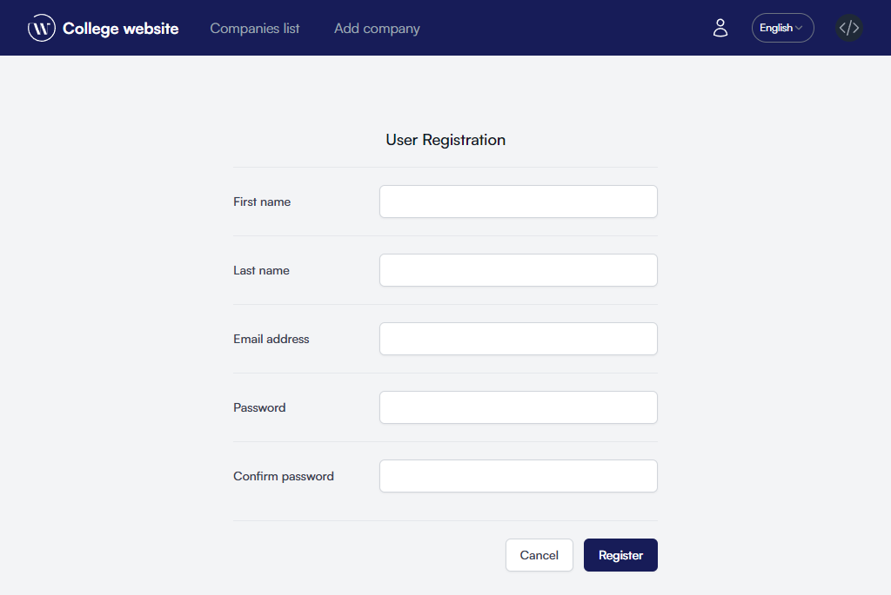
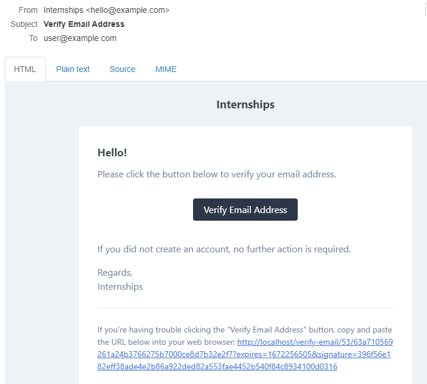
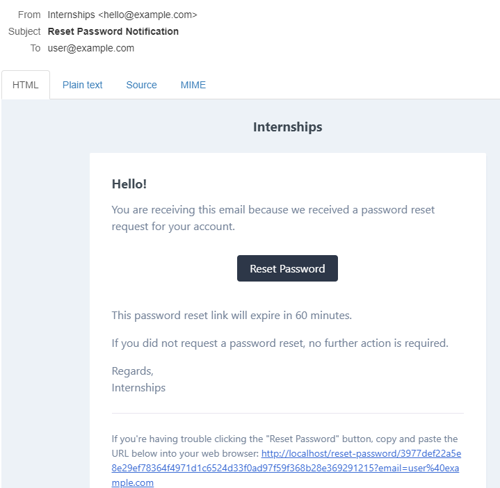

# Account management

## Registration
To create a new account, select `Sign in` from the navigation bar, then click on the `Register` button.

After completing the form, click on the `Register` button.
::: tip
Remember to enter a valid email address, as you will need it to verify your account.
:::
## Email confirmation
Once you have created an account, you need to activate it. To do this, visit your mailbox and locate the message titled `Verify Email Address`. 

To complete the confirmation, click on the `Verify Email Address` button or use the link at the bottom of the message.

## Recovering your password
If you forget your password, you can reset it. To do this, find the link `Don't remember your password?` on the login page.

In the form, enter a valid e-mail address, then click on the `Send link` button. The following message should arrive in your mailbox.

