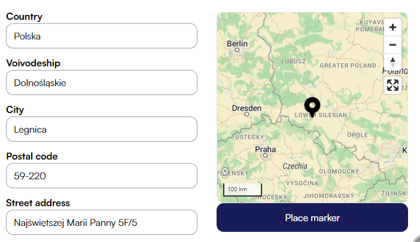
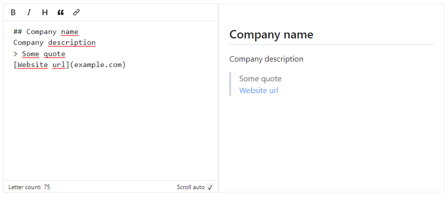
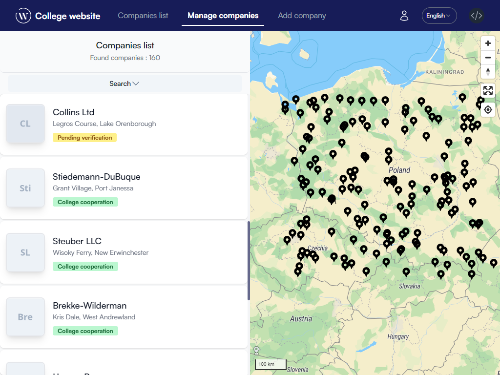
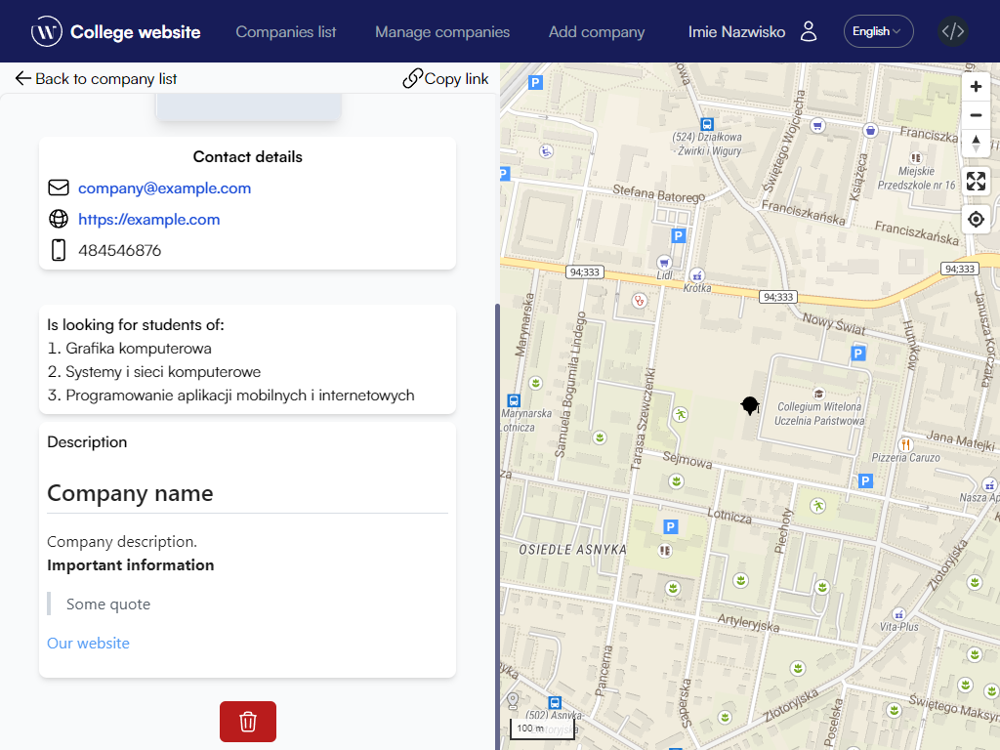

# Managing a company

## Create a new company
Adding a new company is only possible for users who **verified their email address**. The form can be found by selecting the `Add Company` button from the site navigation bar.

The form has three sections. In order to approve the form, each section must be completed correctly.

To set the correct position of the company after completing the address data, click on the `Place marker` button. If the company position is not correct, you can adjust the marker by dragging.

Editing of the company description is done by a special editor using the Markdown language. You can use the buttons in the menu or write the tags yourself.

## Viewing your own companies
The list of companies you added can be found under the `Manage companies` button in the navigation bar. 

A company that has not yet been verified by the site moderator will have a status of `Pending verification`.

When you click on a tile with a company, you can see its description and you can [delete it](#deleting-a-company).

## Deleting a company
In the view with the description of your company, you can delete it. To do this, find the red button at the bottom of the page with the trashcan icon.

Before deleting the company, an adequate message will be displayed confirming the request.