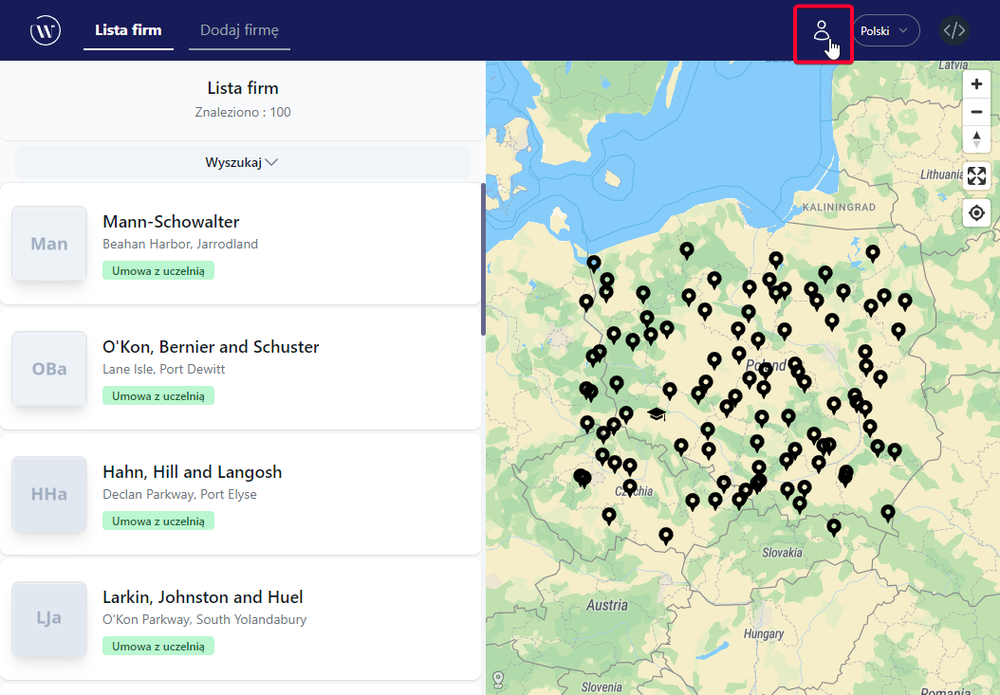
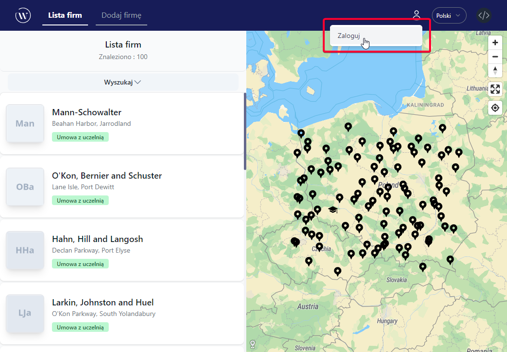
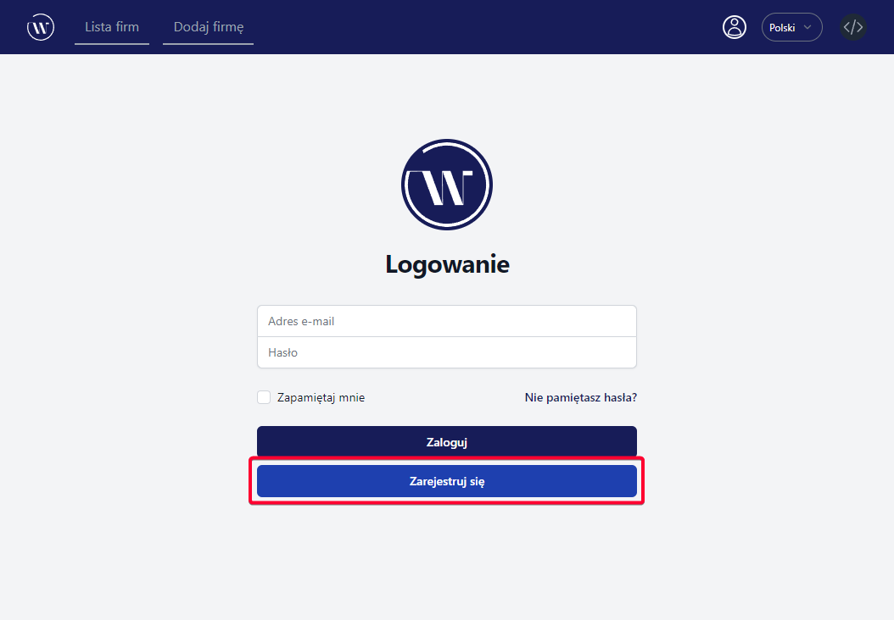
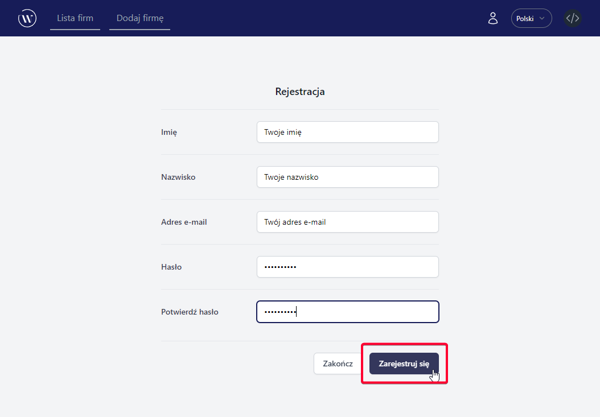
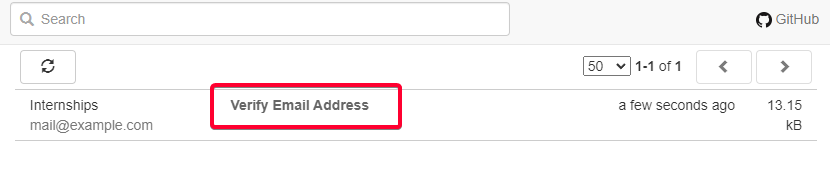
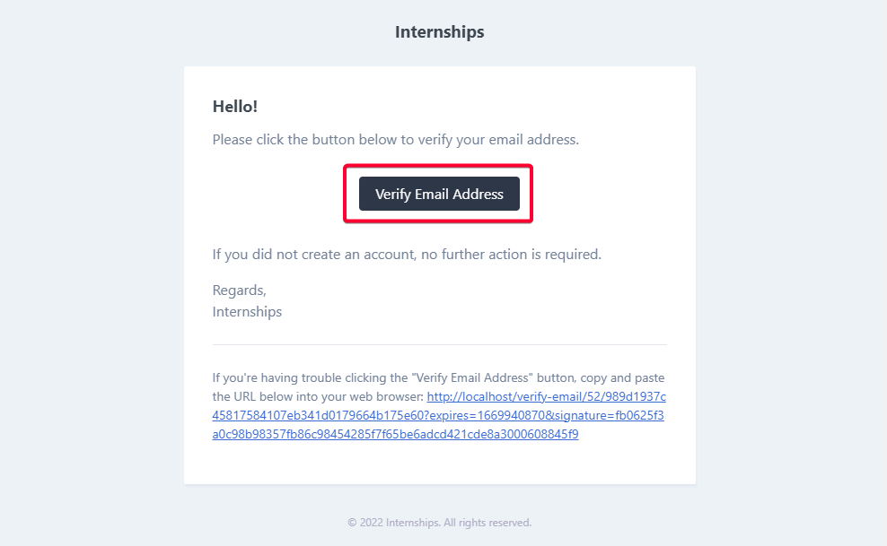
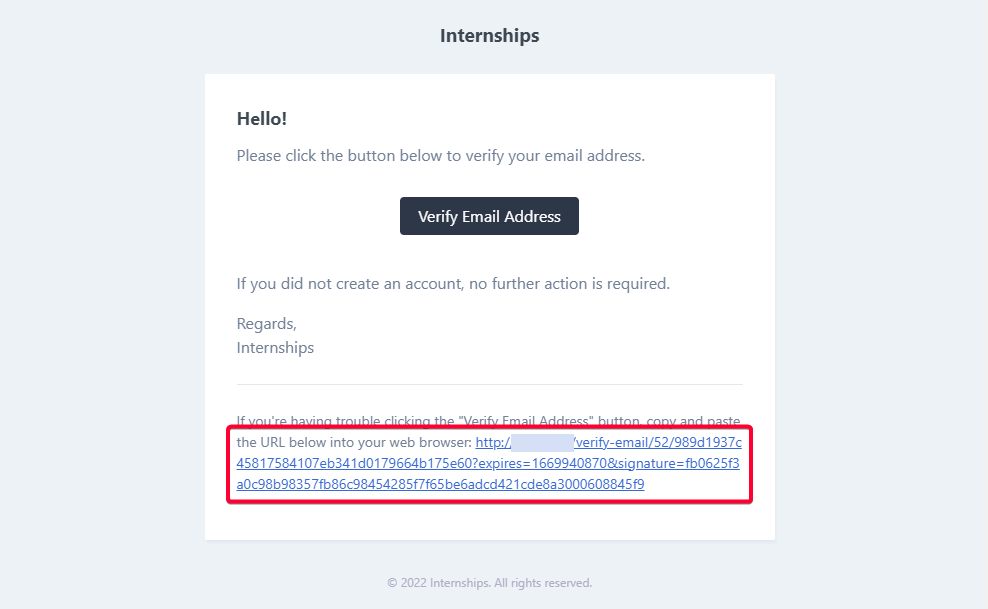
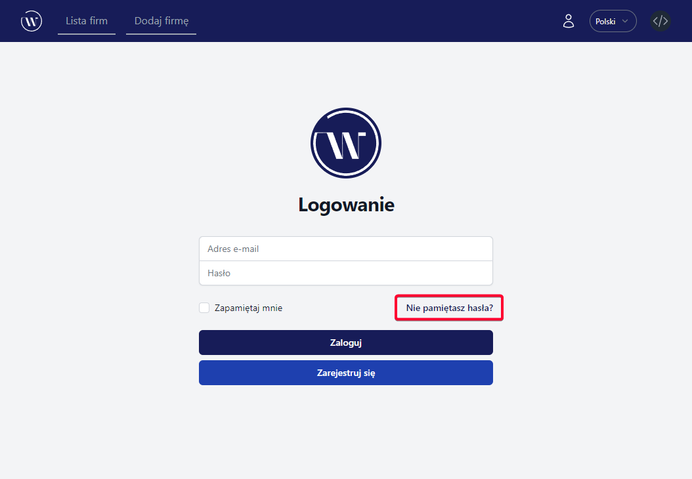
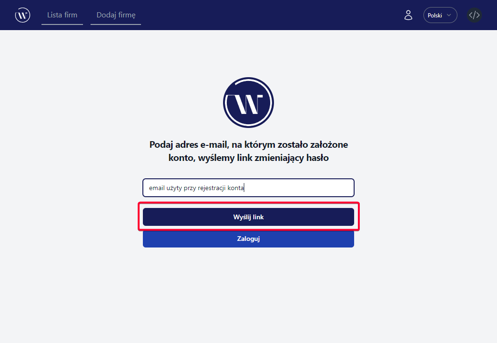

# Zarządzanie kontem

## Rejestracja

1. Kliknij ikonę użytkownika znajdującą się na pasku nawigacyjnym.
   
2. Kliknij w przycisk `Zaloguj`.
   
3. Wybierz przycisk `Zarejestruj się`.
   
4. Uzupełnij formularz i kliknij w przycisk `Zarejestruj się`.
   

## Potwierdzenie maila

1. Wejdź na adres e-mail podany przy rejestracji i odszukaj wiadomość zatytułowaną `Verify Email Address`.
   
2. Aby zweryfikować swój adres e-mail, kliknij w przycisk `Verify Email Address`.
   
3. W przypadku problemów, możesz także uzyć linku na dole wiadomości.
   

## Odzyskiwanie hasła

1. Na stronie logowania kliknij w tekst `Nie pamiętasz hasła?`.
   
2. Wpisz adres e-mail użyty przy zakładaniu konta, następnie kliknij w `Wyślij link`.
   
