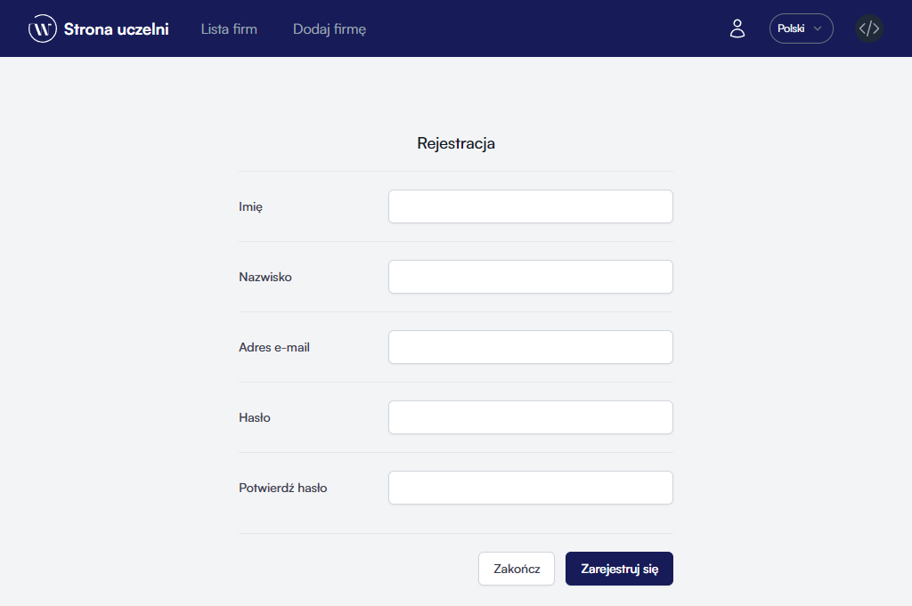
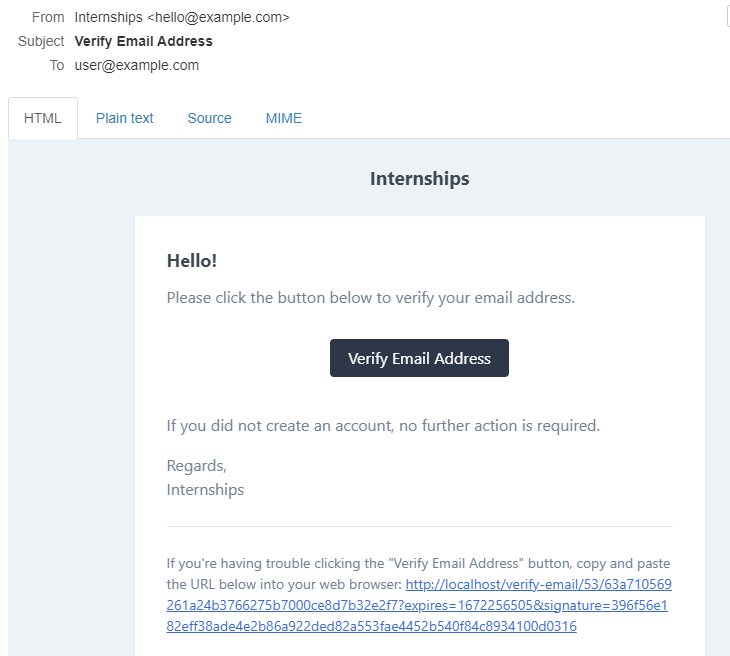
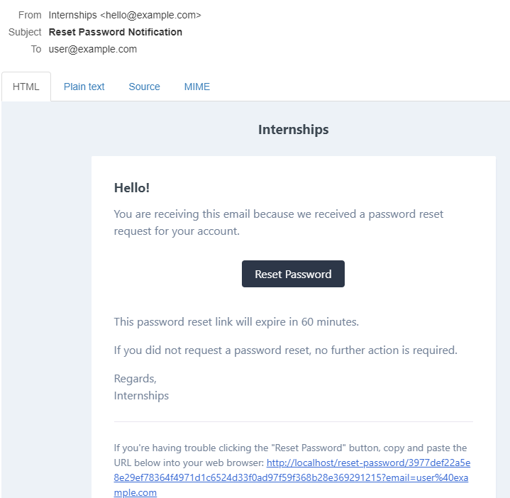

# Zarządzanie kontem

## Rejestracja
W celu założenia nowego konta, wybierz opcję `Zaloguj` z paska nawigacyjnego, następnie kliknij w przycisk `Zarejestruj się`.

Po uzupełnieniu formularza, kliknij w przycisk `Zarejestruj się`.
::: tip
Pamiętaj o wprowadzeniu poprawnego adresu e-mail, ponieważ będzie potrzebny do weryfikacji konta.
:::
## Potwierdzenie maila
Po założeniu konta należy je aktywować. W tym celu odwiedź swoją skrzynkę pocztową i odszukaj wiadomość zatytułowaną `Verify Email Address`. 

Aby dokończyć aktywację, kliknij w przycisk `Verify Email Address` lub skorzystaj z linku na dole wiadomości.
## Odzyskiwanie hasła
W przypadku zapomnienia hasła, można je zresetować. W tym celu należy odszukać na podstronie logowania odnośnik `Nie pamiętasz hasła?`.

W formularzu należy podać poprawny adres e-mail, a następnie kliknąć w przycisk `Wyślij link`. Na Twoją skrzynkę pocztową powinna przyjść poniższa wiadomość.

