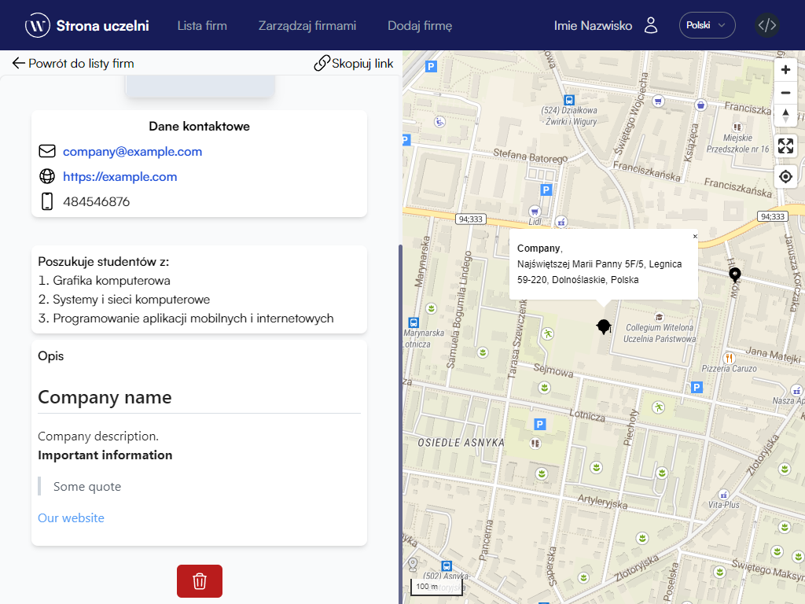

# Zarządzanie firmą

## Dodawanie nowej firmy
Dodawanie nowej firmy możliwe jest jedynie dla użytkowników, którzy **zweryfikowali swój adres e-mail**. Formularz znajduje się po wybraniu przycisku `Dodaj firmę` z paska nawigacyjnego strony.

Formularz składa się z trzech sekcji. W celu zatwierdzenia formularza każda sekcja musi zostać poprawnie uzupełniona.

W celu ustawienia poprawnego położenia firmy po uzupełnieniu danych adresowych należy kliknąć w przycisk `Ustaw marker`. Jeśli położenie firmy jest niepoprawne, można dostosować marker przez przeciągniecie.

Edycja opisu firmy odbywa się przez specjalny edytor wykorzystujący język Markdown. Możesz korzystać z przycisków znajdujących się w menu lub samemu napisać odpowiednie znaczniki.

## Przeglądanie własnych firm
Lista dodanych przez Ciebie firm znajduje się pod przyciskiem `Zarządzaj firmami` w pasku nawigacyjnym. 

Firma, która jeszcze nie została zweryfikowana przez moderatora strony będzie miała status `W oczekiwaniu na weryfikację`.

Po kliknięciu w kafelek z firmą można zobaczyć jej opis oraz ją [usunąć](#usuwanie-firmy).
## Usuwanie firmy
W widoku z opisem Twojej firmy możesz ją usunąć. W tym celu odszukaj czerwony przycisk na dole strony z ikoną kosza na śmieci.

Przed usunięciem firmy zostanie wyświetlone stosowny komunikat potwierdzający usunięcie.